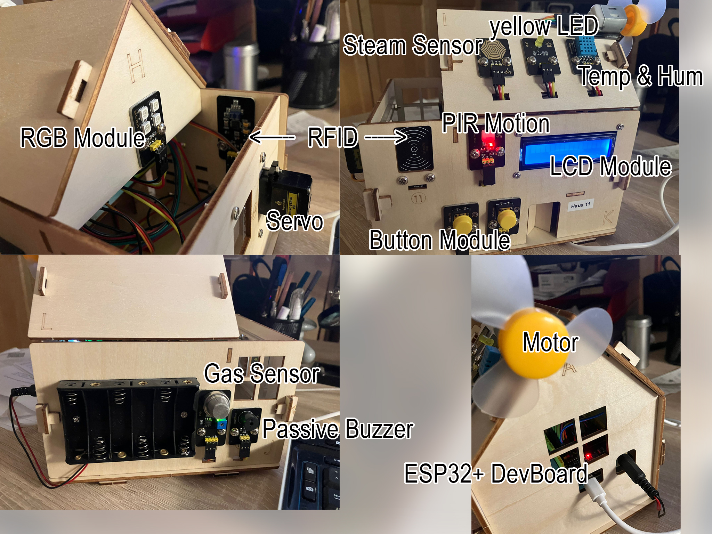

# keyestudio Smart Home

## Überblick Sensoren und Module
Verwendetes Modell: KS5009

Es gibt Unterschiede zum Modell KS0085S, auf die sich das Online-Tutorial bezieht.

### Vergleich der beiden Modelle

| Komponente          | KS5009 | KS0085S |
|---------------------|--------|---------|
|Plus Control Board      |❌|✅|
|ESP32+ DevBoard         |✅|❌|
|Keyestudio Sensor Shield|❌|✅|
|White LED Module        |❌|✅|
|Yellow LED Module       |✅|✅|
|RGB LED Module          |✅|❌|
|Button Module           |✅✅|✅✅|
|Photocell Sensor        |❌|✅|
|PIR Motion Sensor       |✅|✅|
|Gas Sensor              |✅|✅|
|Relay Module            |❌|✅|
|Bluetooth HM20 Module   |integriert in ESP32+|✅|
|Passive Buzzer Module   |✅|✅|
|Motor/Fan               |✅|✅|
|Steam Sensor            |✅|✅|
|Servo Motor (Fenster)   |✅|✅|
|LCD Display             |✅|✅|
|Soil Huminity Sensor    |❌|✅|
|RFID Module             |✅|❌|
|Temp and Hum Sensor     |✅|❌|

ESP32PLUS ist ein universelles WLAN- und Bluetooth-Entwicklungsboard auf ESP32-Basis, integriert mit dem ESP32-WOROOM-32-Modul und kompatibel mit Arduino. Es verfügt über einen Hall-Sensor, High-Speed-SDIO/SPI, UART, I2S sowie I2C. Es mit dem freeRTOS-Betriebssystem.

